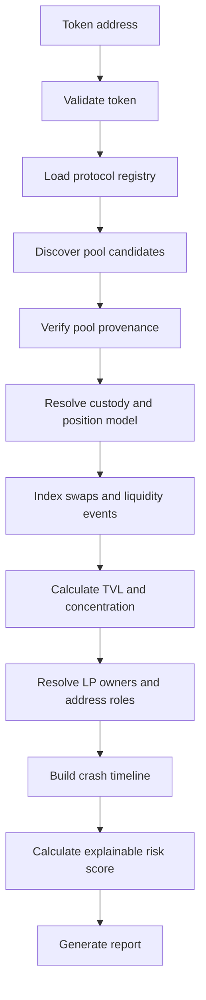

# On-Chain Token Crash & Liquidity Analysis

**Date:** 2026-07-02  

---

## 1. Project Goal

Build an end-to-end analysis system that accepts a token contract address and answers:

> Where is the token liquid, who controls the liquidity, what changed around the price crash, and did liquidity withdrawal materially contribute to the crash?

The system should:

1. discover all supported liquidity pools containing the token;
2. identify the exact protocol contracts related to each pool;
3. reconstruct swaps, liquidity additions, and liquidity removals;
4. identify LP holders or position owners;
5. calculate TVL, pool concentration, and LP concentration;
6. reconstruct the crash timeline;
7. generate an explainable risk report.

### MVP input

```json
{
  "chain_id": 1,
  "token_address": "0x...",
  "from_block": 19000000,
  "to_block": 19100000,
  "incident_timestamp": "optional"
}
```

### MVP output

```text
output/
├── pools.json
├── liquidity_events.json
├── swaps.json
├── positions.json
├── address_labels.json
├── incident_timeline.json
├── risk_assessment.json
└── report.md
```

---

## 2. Important Concept: There Is No Single “DEX Address”

“Find the DEX address from a token” is not precise enough.

A DEX normally contains several contract types:

| Component | Main purpose |
|---|---|
| Factory / Registry | Creates or registers pools |
| Router | User-facing swap and liquidity entry point |
| Pair / Pool | Stores pool state and sometimes holds assets |
| PositionManager | Represents and manages LP positions |
| Vault | Holds and accounts for assets for multiple pools |
| PoolManager | Manages multiple logical pools in one singleton contract |
| Gauge / Locker | Holds LP tokens or LP NFTs for staking or locking |
| Pool ID | Identifies a logical pool inside a Vault or PoolManager |

The analysis must separate:

```text
Protocol deployment
    ↓
Pool identity
    ↓
Asset custody/accounting
    ↓
LP position representation
    ↓
Current holder / beneficial owner
```

A Router should not be treated as the pool or as the long-term holder of liquidity.

---

## 3. Recommended Scope

### Phase 1: Required MVP

- Ethereum mainnet;
- Uniswap V2;
- Uniswap V3;
- historical incident analysis;
- Markdown report generation.

### Phase 2: Optional extensions

- Balancer V2;
- Uniswap V4;
- Curve and other DEXs;
- address clustering;
- real-time monitoring and alerts.

The first version should not attempt to support every protocol.

---

## 4. Protocol Whitelist Strategy

A whitelist is needed, but it should contain **trusted protocol deployments**, not manually listed pools.

Example:

```yaml
chain_id: 1

protocols:
  - protocol: uniswap
    version: v2
    architecture: direct_pair
    factory: "0x5C69bEe701ef814a2B6a3EDD4B1652CB9cc5aA6f"
    router: "0x7a250d5630B4cF539739dF2C5dAcb4c659F2488D"
    adapter: UniswapV2Adapter

  - protocol: uniswap
    version: v3
    architecture: concentrated_pool
    factory: "0x1F98431c8aD98523631AE4a59f267346ea31F984"
    position_manager: "0xC36442b4a4522E871399CD717aBDD847Ab11FE88"
    adapter: UniswapV3Adapter
```

The registry should store:

- chain ID;
- protocol and version;
- Factory, Router, Vault, PoolManager, or PositionManager;
- deployment block;
- ABI version;
- official source;
- adapter name;
- enabled status.

### Why not whitelist every pool?

Pool-level whitelisting would:

- miss newly created pools;
- require continuous manual updates;
- prevent exhaustive discovery;
- fail for protocols where a pool is represented by a `poolId`.

The correct rule is:

> Whitelist protocol deployments; discover pools dynamically; verify every discovered pool on-chain.

---

## 5. End-to-End Workflow



---

## 6. Token Validation

Before pool discovery:

1. verify that the token address contains contract bytecode;
2. normalize the checksum address;
3. read `name`, `symbol`, `decimals`, and `totalSupply`;
4. detect proxy and implementation addresses when possible;
5. record unusual behavior:
   - fee-on-transfer;
   - rebasing;
   - minting;
   - pausing;
   - blacklisting;
6. never identify a token by symbol alone.

Example record:

```json
{
  "chain_id": 1,
  "address": "0x...",
  "symbol": "TOKEN",
  "decimals": 18,
  "is_contract": true,
  "proxy_address": null,
  "implementation_address": null,
  "behavior_flags": []
}
```

---

## 7. Finding DEX Pools and Related Addresses

## 7.1 Uniswap V2

### Architecture

```text
Factory
  ├── TOKEN/WETH Pair
  ├── TOKEN/USDC Pair
  └── TOKEN/OTHER Pair
```

Each Pair:

- is a dedicated contract;
- holds token reserves;
- issues ERC-20 LP tokens;
- emits `Mint`, `Burn`, `Swap`, and `Sync`.

For V2:

```text
pool_address = Pair address
custody_address = Pair address
position_model = ERC-20 LP token
```

### Fast discovery

Query common quote assets:

```solidity
factory.getPair(targetToken, WETH)
factory.getPair(targetToken, USDC)
factory.getPair(targetToken, USDT)
factory.getPair(targetToken, DAI)
```

This is fast but incomplete.

### Exhaustive discovery

Index the trusted Factory event:

```solidity
event PairCreated(
    address indexed token0,
    address indexed token1,
    address pair,
    uint256 pairIndex
);
```

Run two log queries:

```text
Query A: token0 == targetToken
Query B: token1 == targetToken
```

Merge and deduplicate the results.

### V2 verification

For every candidate Pair:

1. confirm that the address has bytecode;
2. call `pair.factory()` and compare it with the whitelisted Factory;
3. call `token0()` and `token1()`;
4. confirm that one token is the target token;
5. call `factory.getPair(token0, token1)` and confirm the same Pair;
6. confirm the `PairCreated` event;
7. read `getReserves()`;
8. read raw ERC-20 balances at the Pair;
9. retain historically emptied pools because they may be relevant to a crash.

Do not trust a contract only because it implements `token0()` and `token1()`.

### Finding V2 LP owners

The Pair contract is also the LP ERC-20 token.

Process:

1. index LP-token `Transfer` events;
2. reconstruct holder balances;
3. calculate:

```text
LP share = LP balance / LP total supply
```

4. determine whether the holder is:
   - a wallet;
   - a gauge;
   - a locker;
   - a staking contract;
   - a burn address.

Store both custody and beneficial ownership when possible:

```json
{
  "lp_token_holder": "0xGauge...",
  "beneficial_owner": "0xUser...",
  "resolution_method": "gauge_deposit_event",
  "confidence": 0.85
}
```

---

## 7.2 Uniswap V3

### Architecture

```text
Factory
  ├── TOKEN/WETH, fee 0.05%
  ├── TOKEN/WETH, fee 0.30%
  └── TOKEN/USDC, fee 0.30%

NonfungiblePositionManager
  ├── Position NFT #1
  └── Position NFT #2
```

The same token pair can have multiple pools because the fee tier is part of the pool identity.

For V3:

```text
pool_address = dedicated V3 Pool
custody_address = dedicated V3 Pool
position_manager = NonfungiblePositionManager
position_model = ERC-721 position NFT
```

### Fast discovery

For common quote tokens and enabled fee tiers:

```solidity
factory.getPool(targetToken, quoteToken, fee)
```

Example fee values include `500`, `3000`, and `10000`, but the implementation should ideally obtain enabled fees from Factory events rather than assume a permanent list.

### Exhaustive discovery

Index:

```solidity
event PoolCreated(
    address indexed token0,
    address indexed token1,
    uint24 indexed fee,
    int24 tickSpacing,
    address pool
);
```

Run separate queries for the target token as `token0` and `token1`.

### V3 verification

For every candidate Pool:

1. verify contract bytecode;
2. verify `pool.factory()`;
3. verify `token0()` and `token1()`;
4. verify `fee()` and `tickSpacing()`;
5. confirm `factory.getPool(token0, token1, fee) == pool`;
6. confirm the Factory `PoolCreated` event;
7. read `slot0()` and `liquidity()`.

Do not interpret `liquidity()` as the pool's USD TVL. V3 liquidity is range-dependent.

### Finding V3 LP owners

V3 LP positions are normally managed through:

```text
NonfungiblePositionManager
0xC36442b4a4522E871399CD717aBDD847Ab11FE88
```

Process:

1. index:
   - ERC-721 `Transfer`;
   - `IncreaseLiquidity`;
   - `DecreaseLiquidity`;
   - `Collect`;
2. obtain each `tokenId`;
3. call `positions(tokenId)`;
4. match:
   - token0;
   - token1;
   - fee;
   to a verified Pool;
5. call `ownerOf(tokenId)`;
6. check whether the owner is a wallet, gauge, vault, or locker.

Important:

> A V3 Pool `Mint` event may show the PositionManager as the owner. This does not mean the PositionManager is the economic LP.

The position NFT holder or downstream beneficiary must be resolved.

---

## 7.3 Other Protocol Architectures

These are optional for the first release, but the data model should support them.

### Balancer V2

Balancer uses a central Vault.

```text
Pool / PoolId
     ↓
Balancer Vault
     ↓
Optional Asset Manager
```

The correct process is:

1. index `PoolRegistered`;
2. find the `poolId`;
3. inspect registered tokens;
4. call `Vault.getPoolTokens(poolId)`;
5. call `Vault.getPoolTokenInfo(poolId, token)`.

Do not use:

```solidity
token.balanceOf(poolAddress)
```

The Pool contract may not hold the underlying assets.

### Uniswap V4

V4 uses a singleton PoolManager.

```text
PoolManager
  ├── PoolId A
  ├── PoolId B
  └── PoolId C
```

A V4 pool may have no dedicated contract address.

Store:

```json
{
  "pool_address": null,
  "pool_id": "0x...",
  "custody_address": "PoolManager",
  "hooks_address": "0x...",
  "custody_model": "singleton"
}
```

---

## 8. Transfer-Based Reverse Discovery

Scanning the target token's `Transfer` events may reveal contracts that hold or frequently move the token.

This can help find:

- unknown pools;
- DEX forks;
- vaults;
- bridges;
- lockers;
- staking contracts.

However, a token-holding contract may also be:

- a Router;
- treasury;
- CEX wallet;
- bridge;
- airdrop contract;
- malicious contract;
- ordinary multisig.

Therefore, Transfer analysis should generate candidates only.

```text
Token Transfer events
       ↓
Candidate contracts
       ↓
Interface and code analysis
       ↓
Factory / Registry provenance check
       ↓
Verified pool or labeled non-pool address
```

---

## 9. Normalized Data Model

Do not create a single `dex_address` field.

Recommended pool record:

```json
{
  "chain_id": 1,
  "protocol": "uniswap",
  "version": "v3",
  "architecture": "concentrated_pool",

  "factory_address": "0x...",
  "router_addresses": [],
  "pool_address": "0x...",
  "pool_id": null,

  "custody_address": "0x...",
  "position_manager_address": "0x...",
  "gauge_addresses": [],
  "hooks_address": null,

  "token0": "0x...",
  "token1": "0x...",
  "fee": 500,

  "creation_block": 0,
  "creation_transaction": "0x...",

  "verified": true,
  "verification_confidence": 1.0
}
```

Normalized event:

```json
{
  "block_number": 0,
  "block_timestamp": 0,
  "transaction_hash": "0x...",
  "log_index": 0,

  "protocol": "uniswap",
  "version": "v2",
  "pool_address": "0x...",

  "event_type": "LIQUIDITY_REMOVE",
  "actor": "0x...",
  "recipient": "0x...",

  "token0_amount": "0",
  "token1_amount": "0",
  "liquidity_delta": "-123",

  "source_event": "Burn",
  "verified": true
}
```

---

## 10. Event Reconstruction

### Uniswap V2 events

Use:

- `Mint`;
- `Burn`;
- `Swap`;
- `Sync`;
- LP-token `Transfer`.

Important:

- `Burn.sender` may be a Router rather than the LP;
- inspect LP-token transfers and transaction calls;
- the `to` field identifies the recipient of withdrawn assets;
- compare reserve changes with the event amounts.

### Uniswap V3 events

Use both Pool and PositionManager events.

Pool:

- `Initialize`;
- `Mint`;
- `Burn`;
- `Collect`;
- `Swap`.

PositionManager:

- ERC-721 `Transfer`;
- `IncreaseLiquidity`;
- `DecreaseLiquidity`;
- `Collect`.

Correlate events by:

- transaction hash;
- log order;
- token ID;
- token pair;
- fee;
- tick range;
- recipient.

A V3 liquidity decrease and asset collection are separate actions.

---

## 11. Liquidity and Risk Metrics

Required metrics:

- total verified DEX liquidity;
- main-pool TVL;
- main-pool share of total liquidity;
- number of active pools;
- top LP share;
- Top-5 LP share;
- LP concentration;
- liquidity removed during the incident;
- liquidity removed as a percentage of pre-event TVL;
- time between removal and crash;
- estimated depth or slippage change;
- large-sell volume;
- relationship between LP and token deployer.

Example:

```text
Main pool concentration =
    main pool TVL / total verified DEX TVL
```

```text
Withdrawal severity =
    removed liquidity value / pre-event pool TVL
```

Every USD value must include:

- block number;
- price source;
- timestamp;
- confidence or approximation note.

---

## 12. Crash Timeline and Interpretation

Recommended event order:

```text
Pool creation
  → Initial liquidity
  → Liquidity concentration
  → LP-token or NFT movement
  → Liquidity reduction
  → Asset collection
  → Large token sales
  → Price collapse
  → Withdrawal routing
```

The report should test:

- did liquidity removal occur before or after the first major sell?
- what percentage was removed?
- did market depth materially decline?
- did the same or a related address also sell tokens?
- was liquidity migrated to another verified pool?
- did minting, pausing, blacklisting, or an exploit occur?
- did the broader market move similarly?

Use cautious conclusions:

> The liquidity withdrawal is temporally and economically consistent with a major crash trigger.

Do not automatically conclude:

> The team performed a rug pull.

---

## 13. Explainable Risk Score

A simple configurable score can combine:

| Component | Example |
|---|---|
| Pool concentration | Main pool / total DEX liquidity |
| LP concentration | Largest LP or entity share |
| Withdrawal severity | Removed value / pre-event TVL |
| Temporal proximity | Time from withdrawal to crash |
| Role sensitivity | Deployer or associated address |
| Market impact | Depth, slippage, and price change |
| Combined activity | Withdrawal plus large sell |
| Migration adjustment | Reduce risk for verified migration |
| Evidence confidence | Penalize incomplete evidence |

Illustrative formula:

```text
raw_score =
    0.15 × pool_concentration
  + 0.15 × lp_concentration
  + 0.20 × withdrawal_severity
  + 0.15 × temporal_proximity
  + 0.15 × role_sensitivity
  + 0.15 × market_impact
  + 0.05 × combined_activity

final_score =
    clamp(raw_score - migration_adjustment, 0, 1)
    × evidence_confidence
```

The report must display the feature values rather than only the final number.

---

## 14. Real Mainnet Example: USDC/WETH

This example validates the discovery method using real Ethereum contracts.

### Inputs

| Item | Value |
|---|---|
| Chain | Ethereum mainnet |
| USDC | `0xA0b86991c6218b36c1d19D4a2e9Eb0cE3606eB48` |
| WETH | `0xC02aaA39b223FE8D0A0e5C4F27eAD9083C756Cc2` |
| V2 Factory | `0x5C69bEe701ef814a2B6a3EDD4B1652CB9cc5aA6f` |
| V2 Router02 | `0x7a250d5630B4cF539739dF2C5dAcb4c659F2488D` |
| V3 Factory | `0x1F98431c8aD98523631AE4a59f267346ea31F984` |
| V3 PositionManager | `0xC36442b4a4522E871399CD717aBDD847Ab11FE88` |

### Step 1: Find the V2 Pair

```bash
cast call \
  0x5C69bEe701ef814a2B6a3EDD4B1652CB9cc5aA6f \
  "getPair(address,address)(address)" \
  0xA0b86991c6218b36c1d19D4a2e9Eb0cE3606eB48 \
  0xC02aaA39b223FE8D0A0e5C4F27eAD9083C756Cc2 \
  --rpc-url "$ETH_RPC_URL"
```

Expected Pair:

```text
0xB4e16d0168e52d35CaCD2c6185b44281Ec28C9Dc
```

Verify:

```bash
PAIR=0xB4e16d0168e52d35CaCD2c6185b44281Ec28C9Dc

cast call "$PAIR" "factory()(address)" --rpc-url "$ETH_RPC_URL"
cast call "$PAIR" "token0()(address)" --rpc-url "$ETH_RPC_URL"
cast call "$PAIR" "token1()(address)" --rpc-url "$ETH_RPC_URL"
cast call "$PAIR" \
  "getReserves()(uint112,uint112,uint32)" \
  --rpc-url "$ETH_RPC_URL"
```

Interpretation:

```text
pool_address = Pair
custody_address = Pair
LP representation = ERC-20 Pair token
```

### Step 2: Find V3 Pools

#### 0.05% pool

```bash
cast call \
  0x1F98431c8aD98523631AE4a59f267346ea31F984 \
  "getPool(address,address,uint24)(address)" \
  0xA0b86991c6218b36c1d19D4a2e9Eb0cE3606eB48 \
  0xC02aaA39b223FE8D0A0e5C4F27eAD9083C756Cc2 \
  500 \
  --rpc-url "$ETH_RPC_URL"
```

Expected:

```text
0x88e6A0c2dDD26FEEb64F039a2c41296FcB3f5640
```

#### 0.30% pool

```bash
cast call \
  0x1F98431c8aD98523631AE4a59f267346ea31F984 \
  "getPool(address,address,uint24)(address)" \
  0xA0b86991c6218b36c1d19D4a2e9Eb0cE3606eB48 \
  0xC02aaA39b223FE8D0A0e5C4F27eAD9083C756Cc2 \
  3000 \
  --rpc-url "$ETH_RPC_URL"
```

Expected:

```text
0x8ad599c3A0ff1De082011EFDDc58f1908eb6e6D8
```

This proves that one pair can map to:

- one V2 Pair;
- multiple V3 Pools;
- different position representations.

### Step 3: Verify the V3 0.05% Pool

```bash
POOL=0x88e6A0c2dDD26FEEb64F039a2c41296FcB3f5640

cast call "$POOL" "factory()(address)" --rpc-url "$ETH_RPC_URL"
cast call "$POOL" "token0()(address)" --rpc-url "$ETH_RPC_URL"
cast call "$POOL" "token1()(address)" --rpc-url "$ETH_RPC_URL"
cast call "$POOL" "fee()(uint24)" --rpc-url "$ETH_RPC_URL"
cast call "$POOL" "tickSpacing()(int24)" --rpc-url "$ETH_RPC_URL"
cast call "$POOL" \
  "slot0()(uint160,int24,uint16,uint16,uint16,uint8,bool)" \
  --rpc-url "$ETH_RPC_URL"
```

Expected identity:

```text
Factory = official V3 Factory
Pair = USDC/WETH
Fee = 500
Factory.getPool(USDC, WETH, 500) = Pool
```

### Step 4: Find V3 LP owners

Index PositionManager events, collect the position NFT `tokenId`, and call:

```bash
cast call \
  0xC36442b4a4522E871399CD717aBDD847Ab11FE88 \
  "positions(uint256)(uint96,address,address,address,uint24,int24,int24,uint128,uint256,uint256,uint128,uint128)" \
  <TOKEN_ID> \
  --rpc-url "$ETH_RPC_URL"

cast call \
  0xC36442b4a4522E871399CD717aBDD847Ab11FE88 \
  "ownerOf(uint256)(address)" \
  <TOKEN_ID> \
  --rpc-url "$ETH_RPC_URL"
```

Then check whether the returned owner is:

- a wallet;
- a gauge;
- a vault;
- a locker.

### Applying the example to a crash token

Replace USDC with the target token and:

1. discover all verified pools;
2. aggregate their TVL;
3. identify the main pool;
4. reconstruct LP ownership;
5. detect large liquidity removals;
6. identify withdrawal recipients;
7. correlate withdrawals with sells and price changes;
8. check for liquidity migration;
9. trace withdrawn funds;
10. generate a confidence-qualified report.

---

## 15. Task Breakdown

## Task 1 — Protocol registry

Implement:

- trusted deployment whitelist;
- ABI management;
- deployment-block metadata;
- protocol adapter configuration.

**Deliverable:** `protocols.ethereum.yaml`

**Acceptance:** Unknown Factories are never marked as trusted.

---

## Task 2 — Token profiler

Implement:

- bytecode validation;
- ERC-20 metadata;
- proxy detection;
- token-behavior flags;
- quote-asset registry.

**Deliverable:** `token_profile.json`

**Acceptance:** Non-standard metadata does not crash the pipeline.

---

## Task 3 — Pool discovery

Implement:

- V2 `getPair` and `PairCreated`;
- V3 `getPool` and `PoolCreated`;
- fast and exhaustive modes;
- log chunking and deduplication.

**Deliverable:** `pool_candidates.json`

**Acceptance:** The real pools in Section 14 are found automatically.

---

## Task 4 — Pool verification and custody resolution

Implement:

- Factory verification;
- token-pair verification;
- event provenance;
- architecture classification;
- V2 Pair custody;
- V3 Pool and PositionManager resolution.

**Deliverable:** `verified_pools.json`

**Acceptance:** A fake pool-like contract is rejected.

---

## Task 5 — Event indexer

Implement:

- V2 Pair and LP-token events;
- V3 Pool and PositionManager events;
- target-token transfers;
- block timestamps;
- retry, checkpoint, and reorg handling.

**Deliverable:** normalized events in JSON or Parquet.

**Acceptance:** Repeated indexing is idempotent.

---

## Task 6 — Position and address analysis

Implement:

- V2 LP-token holder reconstruction;
- V3 position NFT mapping;
- holder versus beneficial owner;
- deployer, initial LP, treasury, whale, gauge, and locker labels;
- evidence and confidence.

**Deliverable:** `positions.json` and `address_labels.json`

**Acceptance:** PositionManager is not mislabeled as the economic LP.

---

## Task 7 — Liquidity and crash analytics

Implement:

- price and TVL timeline;
- main-pool dominance;
- LP concentration;
- withdrawal severity;
- crash-window construction;
- event ordering;
- alternative-cause checks;
- explainable risk score.

**Deliverable:** `incident_timeline.json` and `risk_assessment.json`

**Acceptance:** A post-crash withdrawal is not described as a pre-crash cause.

---

## Task 8 — Report generation

Generate:

- pool summary;
- related-address table;
- price and TVL chart;
- liquidity-event timeline;
- risk features;
- evidence links;
- limitations.

**Deliverable:** `report.md`

**Acceptance:** Every material conclusion can be traced to an event, call, or data source.

---

## 16. Recommended Milestones

### Milestone 1: Pool discovery

- Registry complete;
- V2 and V3 adapters complete;
- USDC/WETH example reproduced.

### Milestone 2: Event reconstruction

- V2 and V3 events normalized;
- LP owners or position holders resolved;
- historical state reads supported.

### Milestone 3: Incident report

- crash timeline;
- TVL and concentration metrics;
- role labels;
- explainable score;
- reproducible report.

### Milestone 4: Extensions

- Balancer V2;
- Uniswap V4;
- address clustering;
- real-time alerts.

---

## 17. Minimum Acceptance Checklist

- [ ] Input is a chain ID and token address.
- [ ] Token address is validated.
- [ ] Protocol deployments come from a versioned whitelist.
- [ ] Pools are discovered dynamically.
- [ ] V2 and V3 pools are verified against their Factory.
- [ ] Router, Pool, custody, and position addresses are separate fields.
- [ ] V2 LP-token ownership is reconstructed.
- [ ] V3 position NFTs are mapped to pools and owners.
- [ ] Historical swaps and liquidity changes are indexed.
- [ ] TVL and concentration metrics include block and price provenance.
- [ ] Crash timeline preserves event order.
- [ ] Liquidity migration is checked.
- [ ] Risk score exposes all feature values.
- [ ] Conclusions include confidence and limitations.
- [ ] One real incident can be reproduced end-to-end.

---
